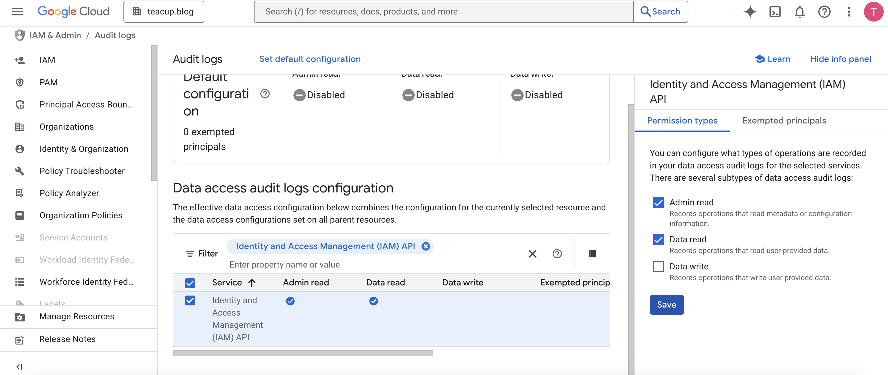
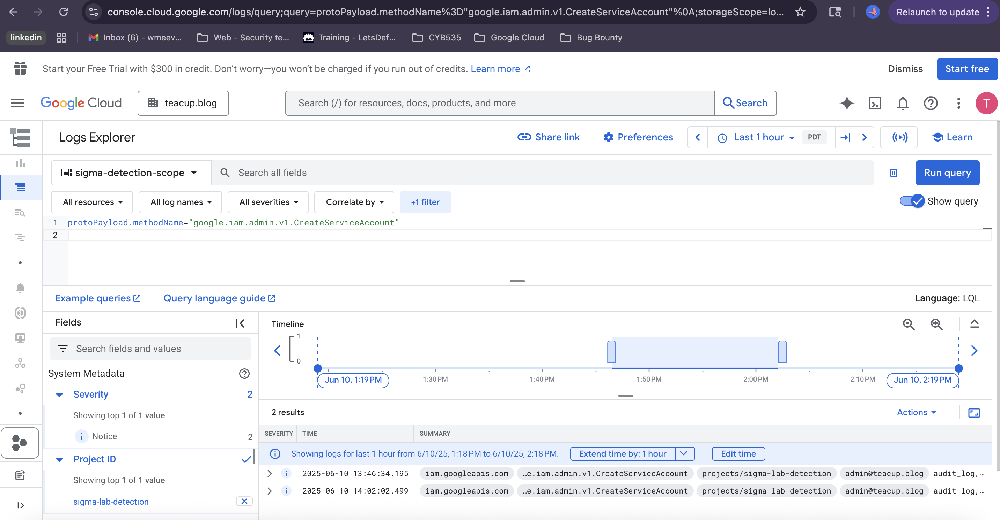

# 🔐 GCP IAM Detection Lab – Sigma Rule for Suspicious Service Account Creation

This lab demonstrates how to detect suspicious IAM behavior in **Google Cloud Platform (GCP)** using **Sigma-based Detection-as-Code**. It focuses on identifying **off-hours service account creation** by analyzing Cloud Audit Logs, tuning detection logic, and versioning everything in GitHub.

---

## 📋 Lab Objectives

✅ Enable Cloud Audit Logs for IAM API  
✅ Simulate suspicious IAM activity using `gcloud`  
✅ Query logs in Logs Explorer  
✅ Write and tune Sigma rule detections  
✅ Validate with real logs and screenshots  
✅ Document findings using Detection-as-Code format

---

## 👨‍💻 Steps Performed

### 1️⃣ Enable Audit Logs for IAM API

- Navigated to **IAM & Admin > Audit Logs**
- Selected: **Identity and Access Management (IAM API)**
- Enabled: ✅ **Admin Read**
- Saved changes to begin logging IAM events

📸 Screenshot:  


---

### 2️⃣ Simulate Suspicious Service Account Creation

- Opened Terminal and ran:

```bash
gcloud iam service-accounts create suspicious-sa \
  --description="Created outside business hours" \
  --display-name="SuspiciousSA"
```
### 3️⃣ Detect the Event in GCP Logs Explorer

- Navigated to **Cloud Logging > Logs Explorer**
- Set resource scope to: `sigma-lab-detection`
- Used the following query:

```sql
protoPayload.methodName="google.iam.admin.v1.CreateServiceAccount"
```
📸 Screenshot:  



```
## 📁 Sample Log Entry

Captured during the lab:

🔹 [`create_sa_sample.json`](./log_samples/create_sa_sample.json.rtf)

This log includes key fields such as:

- `protoPayload.methodName`
- `protoPayload.authenticationInfo.principalEmail`
- `resource.labels.project_id`
- `timestamp`

---

## 🧠 Sigma Rule: Suspicious SA Creation

📄 [`iam_suspicious_sa_creation.yml`](./detections/iam_suspicious_sa_creation.yml.rtf)

This Sigma rule detects service account creation events that occur outside normal business hours and excludes trusted service accounts.

```yaml
detection:
  selection:
    protoPayload.methodName: "google.iam.admin.v1.CreateServiceAccount"
  filter:
    protoPayload.authenticationInfo.principalEmail|not:
      - "admin@teacup.blog"
  condition: selection and not filter
```
🔗 Additional Detection Rule 
📄 [`iam_set_policy.yml`](./detections/iam_set_policy.yml.rtf)

