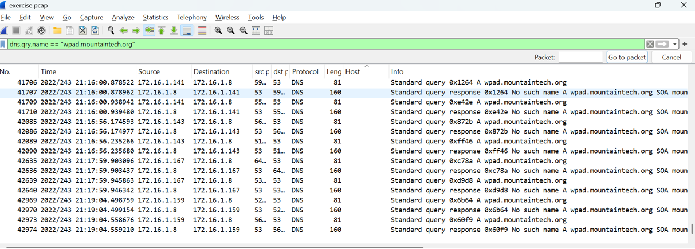

# 🧅 Network Traffic Analysis with Security Onion

This project demonstrates my ability to deploy and operate **Security Onion** in a virtual lab for analyzing network traffic, detecting anomalies, and strengthening security posture. I used real PCAP files and a layered approach for threat detection, validation, and response.

---

## 📌 What I Did

- Installed **Security Onion 2.4** on a virtual machine.
- Imported PCAP files for analysis using Zeek, Suricata, Wireshark (CLI), and Kibana.
- Monitored multiple network segments using separate interfaces.
- Investigated **malicious domains**, **HTTP traffic**, **TLS issues**, and **DNS exploits**.

---

## 🔍 Key Findings

### 🟠 Insecure File Transfers
Observed file types such as `.txt`, `.gif`, and `.html` being transferred via **unencrypted HTTP**, which exposes data in plaintext and increases the risk of MITM attacks.

---

### 🌐 Suspicious HTTP Activity
Domains like `tabletcaptiveportal.com` and `nrgbreakdancing.com` were accessed using `GET` and `POST` methods, which may suggest **phishing** or **redirection attempts**.

---

### 🧅 Malicious Domains Detected
`colorsuckbeh.com` was flagged during SSL inspection. This domain has been linked with **botnet traffic** and **malware delivery**.

---

### 🛑 WPAD Spoofing Behavior
Multiple systems attempted to query `wpad.mountaintech.org`, a potential **WPAD spoofing vector** where attackers can hijack proxy configurations.

---

### 📉 SSL Certificate Failures
Several SSL validation errors were flagged:
- ❗ **Self-signed certificates**
- 🚫 **Unable to get local issuer certificate**
- ⚠️ Use of **deprecated TLS versions** (e.g., TLSv1.0)

These issues can lead to man-in-the-middle attacks or failed trust chains.

---

### 📊 TLS Usage Analysis
Most encrypted traffic used **TLSv1.2**, but some **TLSv1.0** traffic was seen — this outdated protocol poses a security risk.

---

### 📈 Host Log Investigation via Kibana
Using ElasticSearch + Kibana, I tracked traffic flow, source IPs, and organization metadata. A host (Intel device) was making repeated connection attempts without responses.

---

### 🧰 Tool Usage Summary
Security Onion integrates Zeek, Suricata, and the Elastic Stack to provide full-spectrum visibility and layered insights.

---

## 🛡️ Incident Response Approach

1. **Detect** anomalies using Zeek logs and dashboards.
2. **Investigate** traffic with Wireshark and Kibana queries.
3. **Validate** domain/IP reputation and certificate issues.
4. **Respond** by identifying root causes, isolating risky hosts, and proposing mitigations.

---

## 💡 What I Learned

This project deepened my understanding of **network defense and incident response workflows** using open-source tools in a simulated real-world environment.

I went beyond simple packet capture and gained practical experience **analyzing traffic at both the packet and protocol level** with Zeek, Suricata, Wireshark, and Kibana.

By correlating data across dashboards, I identified key indicators of compromise (IOCs), including:
- **Unusual HTTP requests** to suspicious domains
- **TLS/SSL misconfigurations** and outdated protocols
- **Persistent DNS queries** indicating botnet behavior or WPAD abuse
- **Unencrypted file transfers** that expose sensitive data

---

> 🔐 *All data used is simulated and intended strictly for cybersecurity training purposes.*
