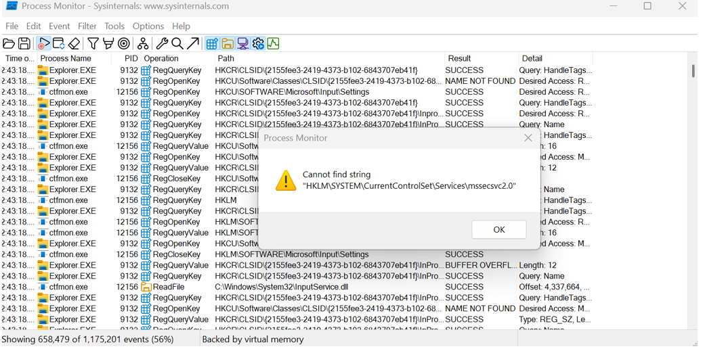

# 🦠 WannaCry Ransomware Case Study

This project simulates a real-world incident response workflow by investigating potential WannaCry ransomware activity on a Windows system. Using Windows-native tools and process monitoring, the goal was to detect behavioral indicators, registry modifications, and malicious persistence.

---

## 🔧 Tools Used

- 🗂️ **Windows Registry Editor** – to search for persistence keys  
- 🧠 **Process Monitor (ProcMon)** – to trace real-time file, registry, and process activity  
- 📊 **Task Manager** – to observe process behavior and resource usage  

---

## 🧪 Analysis Workflow

### 📝 1. Registry Analysis
- Reviewed keys under `HKCU\Software\Microsoft\Windows\CurrentVersion\Run` and `HKLM\Software\Microsoft\Windows\CurrentVersion\Run`
- Checked `CurrentUser` values and subkeys related to startup execution
- **Findings:** No indicators of persistence or ransomware-related keys were detected

**🔍 Screenshots:**

📌 Registry Editor Check  

📌 Current User Run Key  

---

### 🔎 2. Process Monitoring
- Used ProcMon to capture real-time events during execution of suspect `.exe`  
- Tracked file access, registry calls, and suspicious API usage  
- **Findings:** The executable ran but did not show active encryption behavior or mutex creation. Sample may be dormant or sandbox-aware.

**🔍 Screenshot:**

📌 ProcMon Execution Trace  

---

### 👀 3. Task Manager Observation
- Launched `.exe` and monitored system performance  
- Watched for suspicious CPU/disk usage or file encryption patterns  
- **Findings:** Process was idle, with no visible ransomware behavior during test period

**🔍 Screenshot:**

📌 Ransomware EXE Check  

---

## 🧠 Conclusion

While no encryption or persistence was observed in this sample, this lab demonstrates the workflow of an early-stage malware investigation:

- 🧩 Registry key hunting for signs of persistence  
- 🧠 Behavioral monitoring through ProcMon  
- 👁️ Process visibility and threat triage  

This case study reinforces foundational techniques in **malware detection, IR triage, and Windows endpoint visibility.**

---
