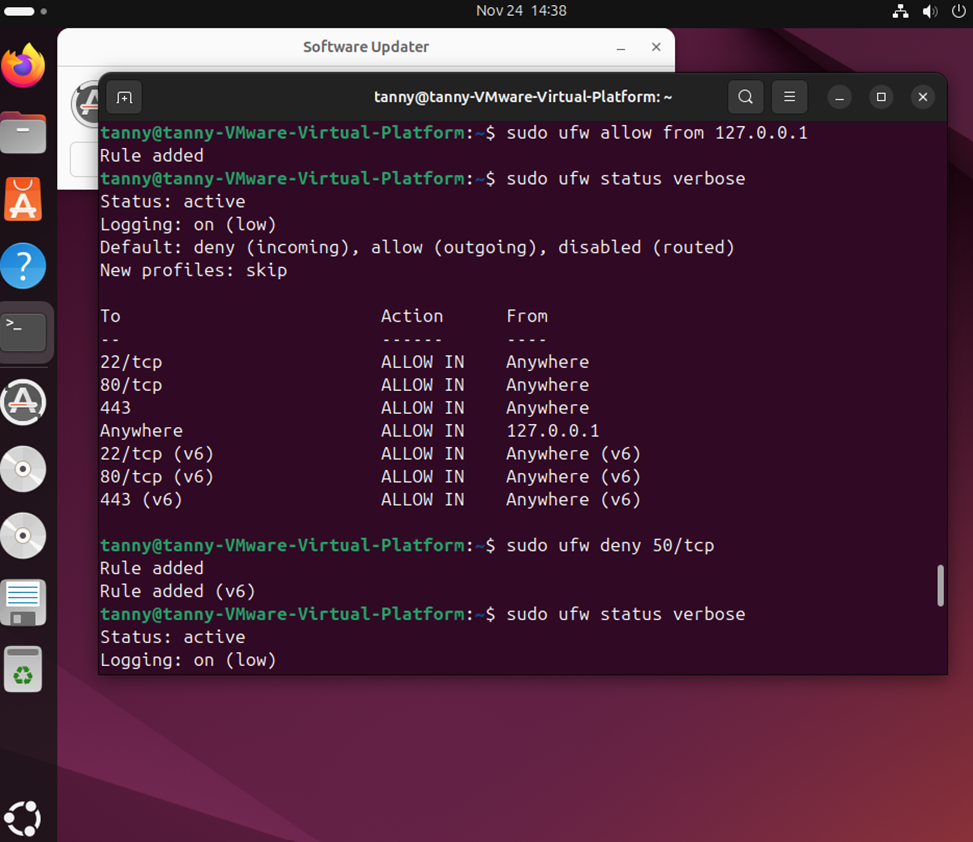

# 🔐 UFW Hardening on Ubuntu

This lab demonstrates how to configure and harden the Uncomplicated Firewall (UFW) on Ubuntu Linux to control inbound and outbound traffic, enforce least privilege, and block unnecessary services.

## 🎯 Objective

- Enforce default-deny policy on inbound connections  
- Allow only essential services (SSH, HTTP, HTTPS)  
- Block suspicious ports and monitor with logging  
- Validate rule effectiveness with Nmap from external VM  

---

## 🧰 Tools & Setup

- 🐧 Ubuntu 20.04 LTS (on VMware)
- 🔥 UFW – Uncomplicated Firewall
- 🛠️ Terminal / SSH access
- 🧪 Nmap (run externally from Kali VM)

---

## ⚙️ Steps Performed

| Action | Purpose |
|--------|---------|
| Allowed SSH from specific IP | Limit admin access (`192.168.1.105` to port `22`) |
| Denied all other inbound traffic | Enforced default-deny posture |
| Enabled logging | Captured and monitored connection attempts |
| Denied specific port (`50/tcp`) | Simulated port block for threat testing |
| Validated firewall with Nmap | Confirmed UFW effectiveness via external scan |

---

## 📸 Screenshots

| Screenshot | Description |
|------------|-------------|
|  | Final active rules (allow SSH, HTTP, HTTPS, deny others) |
|  | Custom rule blocking TCP port 50 |
|  | Nmap scan result from Kali VM confirming blocked access |

---

## ✅ Key Takeaways

- UFW provides easy yet effective host-based firewall control on Ubuntu
- Default-deny posture and selective port allowance reduce attack surface
- Logging supports visibility into traffic and intrusion attempts
- External validation using tools like Nmap ensures firewall enforcement

---

## 🧠 Skills Demonstrated

- 🔒 Linux host hardening  
- 📜 Firewall configuration & rule auditing  
- 🌐 Network traffic control  
- 🚨 External threat simulation & testing  
- 📘 Documentation for security operations  

---

## 📎 License

For educational use only. Do not apply these rules on production without proper change control or impact assessment.
